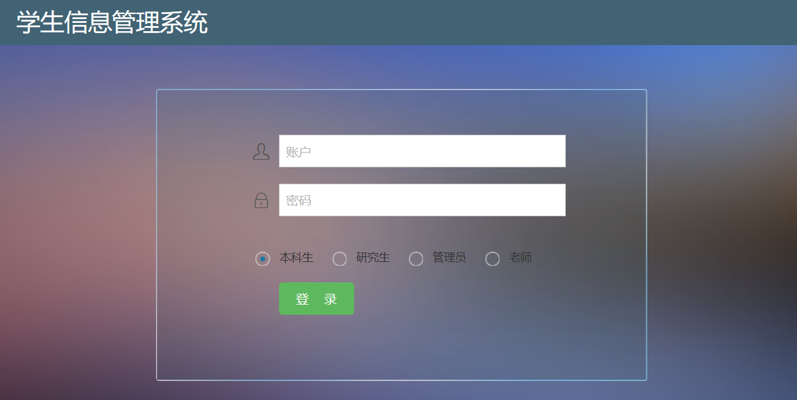
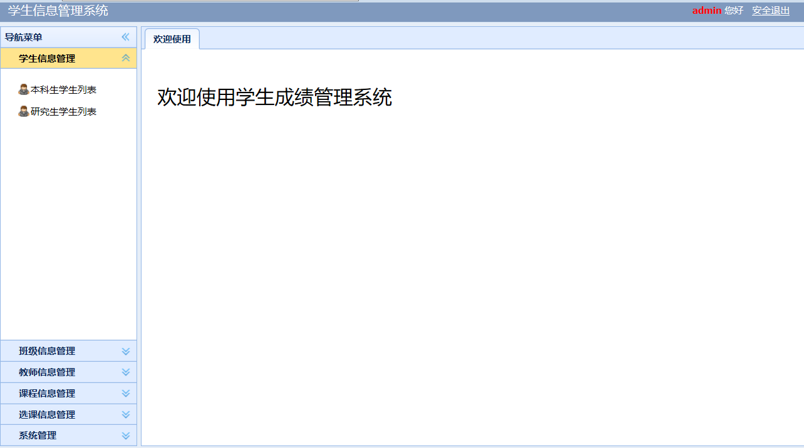

# StudentCourseWeb

it is a student selection system. it can manage the information of students and teachers,andhelp students select courses.

### **development environment**

1)   Minimum PC configuration：CPU above 2G Hz；More than 1G memory；1G free hard drive space；

2)   Above JDK1.8；

3)   Eclipse Ganymede；

4)   Tomcat 8。

### **User Interface**

**Login Interface**

**Menu Interface**

The following is the menu interface for the administrator to enter the system.

